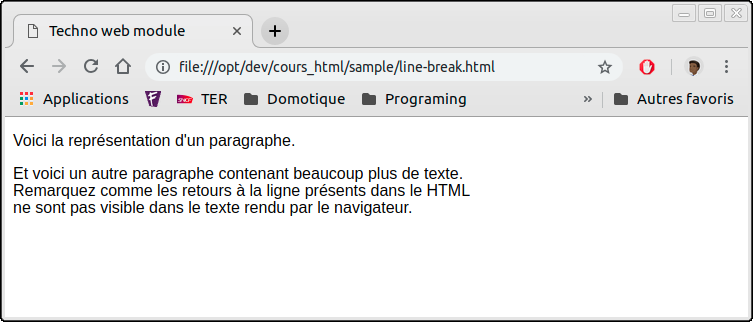
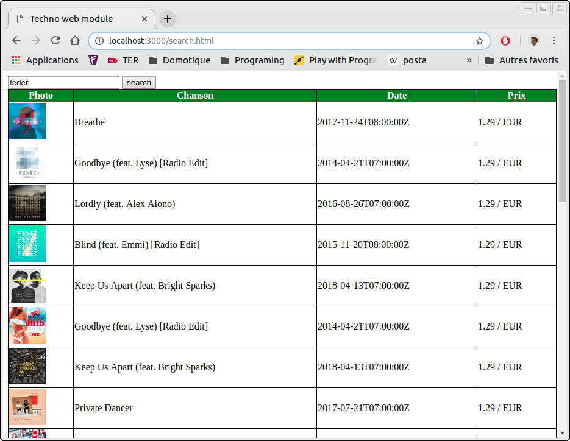

:icons: font
:nofooter:
:doctype: book
:reproducible:
ifdef::backend-html5[]
:source-highlighter: highlightjs
:stylesheet: style/my-style.css
endif::[]
ifdef::backend-pdf[]
:source-highlighter: coderay
endif::[]
//:source-highlighter: rouge

= Cours de HTML & CSS
Auteur <dsix@auchan.com>
v1.0, 2018-09-22
:toc: left

Le développement WEB permet de créer des sites internet comme celui-ci.

.Site Internet
[#img-web-site]
[caption="Figure 1: ",link=https://www.isen.fr/campus/ecole-ingenieurs-lille/]

== Préréquis

=== Outils

Je vous conseil d'utiliser un éditeur évolué :

* Visual Studio Code : https://code.visualstudio.com/
* Atom : https://atom.io/
* NotePad++ (uniquement pour Windows) : https://notepad-plus-plus.org/

Il existe également des environnements de développement plus évolués mais plus gourmand :

* PHP Storm : https://www.jetbrains.com/phpstorm/?fromMenu
* Eclipse : https://www.eclipse.org/downloads/
* Netbeans : https://netbeans.org/downloads/

=== Architecture

==== Client / Serveur

Un navigateur Internet doit accéder à un serveur pour récupérer le contenu à afficher.

.Client - Serveur
[#img-client-serveur]
[caption="Figure 2: "]

. le client, (navigateur Web, appel le serveur
. le serveur passe le relais au moteur PHP
. le moteur PHP récupère les informations dont il a besoin à la BDD
. la BDD répond
. le moteur PHP crée le HTML
. le serveur web répond au client

l'URL est sous la forme : http://www.isen.fr

==== Local

Le navigteur web accède directement au contenu du disque dur de l'ordinateur pour récupérer le contenu à afficher.

.Local
[#img-local]
[caption="Figure 3: "]

l'URL est sous la forme : file:///opt/dev/cours_html/index.html

IMPORTANT: Dans le cadre du cours nous allons travailler en local, sans serveur. Nous allons donc utiliser un editeur de texte et un navigateur Web
pour visualiser nos modifications.

=== Le XML

Le XML est un type de fichier texte structuré. Il est composé d'éléments (des noeuds) imbriqués les uns dans les autres. 

.sample.xml
[#sample.xml]
[source,xml]
----
include::sample/stores.xml[]
----
<1> Le **version** : pour préciser la version de XML et l'encodage du fichier
<2> L’élément **magasins** : c'est le noeud racine il est **unique**
<3> L’élément **magasin** : le noeud sera répété autant de fois qu'il y a un magasin
<4> L’élément **id** : noeud simple ne contenant que du texte
<5> L’élément **adresse** : noeud qui possède un [.underline]#attribut#, ici le type
<6> L'élément **pays** : noeud qui n'a pas de valeur ici.

TIP: Tout élément doit être fermé.

IMPORTANT: Attention à l'imbrication correcte des éléments.

==== Exercice 1

Créez un document XML qui représente un élève. Vous ajouterez les informations suivantes :

* nom
* prénom
* date de naissance

==== Exercice 2

Créez un document XML qui représente un groupe d'élèves. Vous ferez apparaitre les informations suivantes :

* nom du groupe
* liste des **élève**s

==== Exercice 3

Créez un document XML qui représente une classe. Vous ajouterez les informations suivantes :

* niveau
* matiere
* nom du professeur
* liste des **groupe**s

Vous ajouterez également l'[.underline]#attribut# année.

== Présentation générale

=== Séparation des rôles

Dans une page WEB il y a __le contenu__, ce que vous voulez dire, et __la mise en forme__, comment vous le représentez visuellement.
Quand vous allez créer vos pages web, il vous faudra séparer les deux ; chacun son rôle !

==== Exercice

.Séparation des rôles
[#img-content-style]
[caption="Figure 4: "]

Dans cet exemple relever ce qui relève du la forme et ce qui relève du fond.

=== CSS - Cascading StyleSheets

Le CSS est l'outil de changement de style des éléments HTML.

[source,css]
----
include::sample/simple.1.css[]
----
<1> nom du tag : tag que lequel sera appliqué le style
<2> style : éléments du style que l'on veut appliquer

=== HTML - HyperText Markup Language

Les documents HTML sont de simples des documents XML mais respectant une norme encore plus contraignante. 
Cette norme est établie par un consortium (un ensemble de sociétés), le https://www.w3.org/[World Wide Web Consortium (W3C)]

.index.html
[#index.html]
[source,xml]
----
include::sample/index.html[]
----
<1> Le **doctype** : pour préciser le language
<2> L’élément **html** : tout le contenu de la page sera dans les balises
<3> L’élément **head** : contient les meta informations de la page
<4> L’élément **meta** : différentes informations peuvent être définies. Ici c'est le jeu de caractères
<5> L’élément **title** : contient le titre de la fenêtre
<6> L’élément **link** : permet de lier des fichiers externes au document courant. Ici un fichier CSS
<7> L’élément **body** : contient le contenu réel de la page

== Construction du fichier HTML

La norme HTML définis un grand nombre de balises pour vous permettre de définir votre présentation :

* les titres `<Hx></Hx>`
* le paragraphe `

`
* le retour à la ligne ` `
* les tableaux `<table></table>`
* les listes `<ul></ul>` / `<ol></ol>`
* l'image ``
* le lien ``
* caractères spéciaux

=== Les Titres

Le principe des balises `<Hx></Hx>` est d'établir une hiérarchie dans la division de la page.
Il existe donc 6 balises, de 1 à 6, avec 1 le titre le plus important.

IMPORTANT: Les navigateurs apportent d'eux même une différenciation entre l'importance des titres

.titres.html
[#titres.html]
[source,html]
----
include::sample/titres.html[]
----

.Titres
[#img-titres]
[caption="Figure 5: "]

Les balises de titres sont utilisés par les moteurs de recherche pour donner plus d'importance au texte 
du titre dans les résultats des recherches.

=== Le paragraphe

La balise `

` est le symbole de démarcation des paragraphes. Dans le texte de vos HTML, vous pouvez mettre autant de
retour à la ligne que vous voulez.

.paragraphes.html
[#paragraphes.html]
[source,html]
----
include::sample/paragraphes.html[]
----

.Paragraphes
[#img-paragraphes]
[caption="Figure 6: "]

==== Exercice 1

Créez une page HTML avec :

* comme titre de l'onglet : "Le Web c'est le pied"
* un titre principal contenant : "Développement Web"
* un sous titre contenant : "C'est cool !"
* un paragraphe contenant : "Le développement Web permet de faire beaucoup de chose et j'adore cela."

==== Exercice 2

Créez une page HTML ressemblant à celle-ci :

.Exercice 2 Paragraphes
[#img-exercice2-paragraphes]
[caption="Figure 7: "]

=== Le retour à la ligne

Comme nous l'avons vu, les retours à la lignes, dans le HTML, ne sont pas traduit visuellement par un retour à la ligne dans le texte.
Pour gérer manuellement ces retours à la lignes nous avons à notre disposition une balise spécifique : ` `. Comme vous le voyez,
cette balise n'a pas de contenu ; un retour à la ligne est un retour à la ligne.

.line-break.html
[#line-break.html]
[source,html]
----
include::sample/line-break.html[]
----

.Retour à la ligne
[#img-line-break]
[caption="Figure 8: "]

=== Les tableaux

Un tableau est un moyen simple d'aligner des objets. Mais les tableaux peuvent être parfois très compliqués, avec un entête, un pieds, 
des cellules fusionnées. 

IMPORTANT: Il faut utiliser les tableaux en tant que tableau et non en tant qu'outils de mise en forme !

.tableau.html
[#tableau.html]
[source,html]
----
include::sample/tableau.html[]
----

.tableau.css
[#tableau-css.css]
[source,css]
----
include::sample/tableau.css[]
----

.Tableau
[#img-tableau]
[caption="Figure 9: "]

==== Exercice 1

Créez une page HTML ressemblant à celle-ci :

.Exercice 1 tableau
[#img-exercice1-tableau]
[caption="Figure 10: "]

.exercice1-tableau.css
[#exercice1-tableau-css.css]
[source,css]
----
include::sample/exercice1-tableau.css[]
----

=== Les listes

Pour créer une liste il faut d'abord savoir si vous voulez une liste numérotée ou simplement avec des puces.

.liste.html
[#liste.html]
[source,html]
----
include::sample/liste.html[]
----
<1> `<ul>`: unordered list
<2> `<ol>`: ordered list
<3> `<li>`: list item

.Liste
[#img-liste]
[caption="Figure 11: "]

TIP: la seule différence est entre les balises : `<ul>` / `<ol>`

Sur les listes numérotées (valise `<ol>`) il est possible de changer la numérotation en utilisant des lettres avec  l'attribut `type="A"` ou `type="a"`
ou la numérotation en chiffres romains l'attribut `type="I"` ou `type="i"`

.Liste-1
[#img-liste-1]
[caption="Figure 12: "]
image::images/liste.1.png[img-liste-1]

=== L'image

Quand on veut ajouter une image dans une page HTML il faut utiliser la balise ``.

.image.html
[#image.html]
[source,html]
----
include::sample/image.html[]
----

.Image
[#img-image]
[caption="Figure 13: "]

TIP: Les images peuvent, dans certains cas être remplacé par un texte (pour les non voyants par exemple). 
Dans ce cas c'est le contenu du l'attribut `alt` qui sera utilisé.

TIP: Il peut être intéressant d'avoir une information complémentaire sur l'image via une info bulle lorsque la souris est au dessus de l'image. 
Dans ce cas c'est le contenu du l'attribut `title` qui sera utilisé.

=== Le lien

Quand on veut ajouter un lien dans une page HTML il faut utiliser la balise ``.

.lien.html
[#lien.html]
[source,html]
----
include::sample/lien.html[]
----

.Lien
[#img-lien]
[caption="Figure 14: "]

TIP: il est possible un lien vers un contenu de la même page en utilisant un attribut `id` en tant qu'ancre
et la référence de l'ancre dans le lien se fait alors un `#`.

=== Les caractères spéciaux

Certains caractères sont plus réservés, d'autres n'apparaissent pas sur les claviers. Il existe donc une syntaxe particuliaire pour ces caractères. https://brajeshwar.github.io/entities/[Voici un site qui vous présente très bien cela].

.Caracteres
[#img-caracteres]
[caption="Figure 15: "]

=== Validation

Pour qu'un document HTML soit déclaré valide il faut qu'il respecte toutes les règles de base de la normal.
Il existe des validateurs pour cela. http://validator.w3.org/[Voici un validateur online.]

=== [[Formulaires, formulaires]]Les formulaires

Le but d'un formulaire est de faire parvenir des informations au serveur. 

.Client - Serveur
[#img-client-serveur-2]
[caption="Figure 2: "]

. **le client, (navigateur Web, appel le serveur**
. le serveur passe le relais au moteur PHP
. le moteur PHP récupère les informations dont il a besoin à la BDD
. la BDD répond
. le moteur PHP crée le HTML
. le serveur web répond au client

En HTML un formulaire est à considérer comme un block complet avec un délimiteur la balise `<form> ... </form>` 
et les éléments le composant : `<input> ... </input>`.

.formulaire.html
[#formulaire.html]
[source,html]
----
include::sample/formulaire.html[]
----

.Formulaire
[#img-formulaire]
[caption="Figure 14: "]

Il existe un certain nombre d'élements possibles dans les formulaires:

* label
* texte simple
* texte long
* mot de passe
* case à cocher
* champs caché
* fichier
* radio boutton
* liste déroulante
* bouton simple
* bouton de validation
* bouton de reset

==== Formulaire

La balise `form` est celle qui permet de délimiter le formulaire. 
Pour que les informations arrivent correctement au serveur Web, il faut :

- donner la destination `action`
-- c'est l'URL de destination du formulaire (`http://www.monsite.fr/save`)
- donner la `method`
-- soit `GET`: les informations seront transmisent dans l'URL (`http://www.monsite.fr/save?nom=six&prenom=douglas`)
-- soit `POST`: les informations seront transmisent à part, dans la requête

==== Label

Le `label` est un élément qui décrit le champs auquel il est associé.

Attribut important: 

* for: permet de savoir vers quel `ìnput` on va pointer.

==== Texte simple

Le `text` est le champs le plus commun. Il permet de saisir une petite quantité de texte, un nom, un prénom...

* value: valeur par défaut

==== Texte long

Le `textarea` est le champs de saisie des textes long, comme des paragraphes complets.

* cols: taille du champs de saisie en nombre de caractères pour les colonnes
* rows: taille du champs de saisie en nombre de caractères pour les lignes

==== Mode de passe

Le `password` va permettre de saisir un texte qui n'est pas lisible à l'écran. 

* value: valeur par défaut

==== Case à cocher

Le `checkbox` est la case à cocher du formaulaire. 

* value: valeur qui sera renvoyée au serveur si la case est cochée.
* checked: quand on veut pré cocher une case

TIP: Seul les valeurs des cases cochées sont renvoyées au serveur.

==== Champ caché

Le `hidden` est un champ qui n'est pas visible dans le formulaire mais qui permet de faire passer des valeurs
d'un accès au serveur à l'autre, par exemple le numéro de client, l'action en cours.

==== Fichier

L'élément `File` va faire apparaitre dans le navigateur un bouton pour ouvrir une boite de dialogue pour sélectionner
un fichier en local, sur l'ordinateur.

IMPORTANT: Il faut alors que le formulaire soit en `method="post"` et ajouter l'attribut `enctype="multipart/form-data"`

==== Radio bouton

L'élément `radio` permet la sélection **exclusive** d'un élément parmit toutes les options possibles.

IMPORTANT: pour que l'exclusion se fasse correctement il faut que les éléments aient le même `name`.

==== Liste déroulante

Une liste déroulant se décompose en plusieurs élement, à l'image d'une liste `<ul><li></li></ul>`, ici on utilise les élements
`<select><option></option></select>`

TIP: l'attribut `selected` sur une élément `<option>` permet de le rendre pré-sélectionné.

WARNING: si aucune valeur n'est précisé dans `<option>`, alors la valeur renvoyée sera le contenu de l'option: `<option>Le joli bateau bleu</option>`

==== Bouton simple

L'élément `button` est là pour créer un bouton dont il faut implémenter la logique en javascript.

==== Bouton de validation

L'élément `submit` est le bouton qui va réellement déclencher l'envoie du formulaire au serveur.

==== Bouton de reset

L'élément `reset` va vider le contenu des champs, décocher les cases cochées, les radio buttons et remettre les valeurs par défaut
quand il y en a.

== Allons plus loin

Nous avons déjà les principales balises. En voici deux qui permettent de faire des merveilles quand elles sont liées au CSS.

* ``
* `

` 

=== Les blocks SPAN

Le span est un élément de type **inline**. C'est à dire qu'il s'insère dans d'autres éléments sans en changer le comportement.
Nous nous en servons pour compléter / modifier un sous élément.

.span.html
[#span.html]
[source,html]
----
include::sample/span.html[]
----

.Span
[#img-span]
[caption="Figure 15: "]

=== Les blocks DIV

Le span est un élément de type **block**. C'est à dire qu'il entoure d'autres éléments sans en changer le comportement.
Nous nous en servons pour compléter / modifier un ensemble d'éléments.

.div.html
[#div.html]
[source,html]
----
include::sample/div.html[]
----

.Div
[#img-div]
[caption="Figure 16: "]

== le CSS

Maintenant que nous avons vu comment créer les pages HTML et y ajouter du contenu. Nous allons mettre le tout en forme.

=== Les sélecteurs

Pour être capable d'appliquer le style sur un élément, il nous faut le sélectionner. En CSS il y a trois possibilités de sélection d'un élément :

. la balise HTML
. la classe
. l'id

Voici une mise en forme que nous allons réaliser alternativement avec les trois méthodes de sélection à notre disposition :

.Selecteur-css
[#img-selecteur-css]
[caption="Figure 17: "]
image::images/selecteur-css.png[img-selecteur-css]

==== la balise HTML

Pour utiliser les balises HTML il suffit d'utiliser le nom de la balise.

.balise-html.html
[#balise-html.html]
[source,html]
----
include::sample/balise-html.html[]
----

.balise-html.css
[#balise-html-css.css]
[source,css]
----
include::sample/balise-html.css[]
----

==== la classe

Pour utiliser les classes, il faut ajouter l'attribut `class` dans le HTML, puis dans le fichier CSS on prefix le nom de la classe par un `.`

.classe-html.html
[#classe-html.html]
[source,html]
----
include::sample/classe-html.html[]
----

.classe-html.css
[#classe-html-css.css]
[source,css]
----
include::sample/classe-html.css[]
----

==== l'ID

Pour utiliser les ids, il faut ajouter l'attribut `id` dans le HTML, puis dans le fichier CSS on prefix le nom de l'id par un `#`

.id-html.html
[#id-html.html]
[source,html]
----
include::sample/id-html.html[]
----

.id-html.css
[#id-html-css.css]
[source,css]
----
include::sample/id-html.css[]
----

WARNING: Un `id` doit etre unique dans le fichier HTML.

==== Sélection Précise

.checkedboard.html
[#checkedboard.html]
[source,html]
----
include::sample/checkedboard.html[]
----

.checkedboard.css
[#checkedboard-css.css]
[source,css]
----
include::sample/checkedboard.css[]
----

.Checkedboard
[#img-checkedboard]
[caption="Figure 18: "]

=== La mise en forme

==== Les unités

En HTML, il existe plusieurs système d'unité possible:

* Unités absolues
** `px` : pixels
** `pt` : points
* Unités relatives
** `rem` : taille de police relative à la taille définie pour l'élément root (HTML ou BODY)
** `em` : taille de police relative à la taille définie pour l'élément courant
** `vw` : taille relative à 1% de la largeur du **viewport**
** `vh` : taille relative à 1% de la hauteur du **viewport**
** `%` : taille relative à la taille de l'élément parent

TIP: `em` ou `rem` sont pratiques pour définir des interfaces redimensionnables

==== Les couleurs

Il existe plusieurs façons de définir une couleur en HTML:

* avec le nom de la couleur
* avec les composantes RGB (Red Green Blue) exprimées en décimal de 0 à 255
* avec les composantes RGB (Red Green Blue) exprimées en héxadécimal de 00 à FF
* avec une transparence (couche alpha)

.color.html
[#color.html]
[source,html]
----
include::sample/color.html[]
----

.color.css
[#color-css.css]
[source,css]
----
include::sample/color.css[]
----

.Color
[#img-color]
[caption="Figure 19: "]

==== les Fonts

Il existe différents types de polices de caractères dont on peut faire varier la police, la taille, le poids ou le style. 

.font.html
[#font.html]
[source,html]
----
include::sample/font.html[]
----

.font.css
[#font-css.css]
[source,css]
----
include::sample/font.css[]
----

.Font
[#img-font]
[caption="Figure 20: "]

https://fonts.google.com/

Il existe d'autres attributs des Fonts :

* `font-size` : taille de la police
* `font-weight` : texte en gras : `bold`
* `font-style` : text en italique : `italic`

==== Le Text

Il existe un certain nombre de propriété CSS permettant de transformer la façon dont le text est affiché:

* `text-align` : `left`, `right`, `center`, `justify`
* `text-transform` : `lowercase`, `uppercase`, `capitalize`
* `text-decoration` : `underline`, `overline`, `line-through`
* `text-indent` : veleur en pixel (négative ou positive) ou pourcentage

=== Le modèle de boite

Tous les éléments HTML sont représentés sous forme de boites, qu'ils soient de type `inline` ou `block`.

.Box
[#img-boxing]
[caption="Figure 21: "]

On comprend, avec cette image, où se positionnent les marges (`margin`), les bordures (`border`) et les marges intérieures (`padding`) et le contenu 
de l'élément.

.box.html
[#box.html]
[source,html]
----
include::sample/box.html[]
----

.box.css
[#box-css.css]
[source,css]
----
include::sample/box.css[]
----

.Box
[#img-box]
[caption="Figure 22: "]

Ici d'après la CSS, la `DIV` verte fait 450px de long et le `p` 1 en fait 400px. 
Or en regardant le résultat le paragraphe déborde de la `DIV`. 
La `width` de l'élément visible à l'écran est calculée comme ceci : 

`marge gauche + bordure gauche + padding gauche + taille de l'élément + padding droit + bordure droite + marge droite`

Ce qui donne ici : 

`0 + 5 + 60 + 400 + 60 + 5 + 0 = 530px`

.BoxSizing
[#img-box-sizing]
[caption="Figure 23: "]

=== Le positionnement

[#position-css.css]
[source,css]
----
div {
    position: static;
    position: relative;
    position: absolute;
    position: fixed;
    position: inherit;
    position: sticky;
}
----

* static : afficher dans l'ordre d'apparition dans le HTML
* relative : relatif au parent
* adsolute : à l'intérieur du parent
* fixed : à l'intérieur du viewport
* inherit : pour utiliser la même valeur de celle du parent
* sticky : la position varie entre relative et fixed, selon le scroll

=== Le display

[#display-css.css]
[source,css]
----
div {
    display: none;
    display: inline;
    display: block;
    display: inline-block;
    display: flex;
}
----

* none : le composant n'est plus visible dans le HTML et sa place est occupée par autre chose
* inline : pour que le composant se comporte comme un élément `inline`
* block : pour que le composant se comporte comme un élément `block`
* inline-block : pour une élément `inline` dont on veut fixer la largeur et la hauteur 
* flex : pour être capable d'arranger les enfants comme on veut (cf https://www.w3schools.com/css/css3_flexbox.asp[Flex Box])

=== La superposition

[#zindex-css.css]
[source,css]
----
div {
    z-index: 2;
}
----

Le z-index le plus élevé correspond à l'élément le plus haut de la pile.

.z-index.html
[#zindex.html]
[source,html]
----
include::sample/z-index.html[]
----

.z-index.css
[#z-index.css]
[source,css]
----
include::sample/z-index.css[]
----

.Superposition
[#img-z-index]

== Le HTML 5

=== Nouveaux Input

Le HTML5 a ajouté quelques types d'input (retour ici pour les éléments avant le HTML5 : <<Formulaires, Les formulaires>>) :

* color
* date
* datetime-local
* month
* week
* time
* number
* range
* search
* tel
* url
* email

Chacun de ces type de champs apporte une facilité, un confort de saisie pour l'utilisateur, comme pour le développeur. 
L'utilisateur va se voir proposé par le navigateur les données qu'il a déjà saisies dans un champs équivalent. Comme c'est
le navigateur qui se charge de la présentation de l'élément, le visuel est en accord avec le système d'exploitation. Pour le développeur,
il n'aura pas à redévelopper de composant spécifique.

.FormulaireHtml5
[#img-form-html5]
[caption="Figure 24: "]

=== Nouvelles Sections

Le HTML 5 apporte de nouveaux bloc dont le nom permet de donner un sens au contenu de vos pages. Voici les nouvelles balises :

* article
* section
* nav
* aside
* header
* footer

Et voici l'usage que l'on devrait en avoir :

.Html 5 Sementic Sections
[#img-html5-sementic-sections]
[caption="Figure 14: "]

== Le responsive

Le but est de pouvoir adapter au mieux le rendu de la page web au device sur lequel il s'affiche.

.Responsive Desktop
[#img-responsive-desktop]
image::images/rwd_desktop.png[img-responsiveDesktop]

.Responsive Tablette
[#img-responsive-tablet]
image::images/rwd_tablet.png[img-responsiveTablet]

.Responsive téléphone
[#img-responsive-phone]
image::images/rwd_phone.png[img-responsivePhone]

=== Les MediaQuery

[#media-query-css.css]
[source,css]
----

@media only screen and (max-width: 600px) {
    body {
        margin: 0;
    }
}
@media only screen and (max-width: 1024px) {
    body {
        margin: 2px;
    }
}

----

== Les Framework

Ce sont des points de départ, mais il faut faire attention ! Ils ne fonctionnent pas toujours comme on le veut et les
adapter devient vite très compliqué.

.Framework
[#img-framework]
image::images/framework.png[img-framework]

=== Bootstrap

Framework developpé par Twitter, rapide et répandu https://getbootstrap.com/docs/4.1/getting-started/introduction/[Boostrap] 
est le plus connu

=== Materialize

A l'origine développé par Google https://materializecss.com/[Materialize] est un framework pensé pour rendre 
plus simple la compréhension de la navigation.

== Le JavaScript

Le javacript est un language de script qui s'exécute sur le navigateur Web. Il permet d'interagir avec le HTML présent dans la page
en modifiant des éléments, en ajoutant ou en en supprimant.

=== Vanilia JS

On appelle Vanilia JS le code javascript qui n'utilise pas de bibliothèque / framework type JQuery. C'est le javascript de base des navigateurs.
Beaucoup d'entreprises y reviennent car les bibliothèques ajoutent une lenteur et une surcharge sur les navigateurs et la charge réseau.

Voici quelques objets `JS` de base.

==== Window

L'interface https://developer.mozilla.org/en-US/docs/Web/API/Window[Windows] permet d'accéder à certain éléments du navigateur. Voici quelques exemples :

* la taille de la fenêtre : `Window.outerHeight`, `Window.outerWidth` (https://developer.mozilla.org/en-US/docs/Web/API/Window/outerHeight[see here for outerHeight] and https://developer.mozilla.org/en-US/docs/Web/API/Window/outerWidth[here for outerWidth])
* la taille visible dans la fenêtre : `Window.innerHeight`, `Window.innerWidth` (https://developer.mozilla.org/en-US/docs/Web/API/Window/innerHeight[see here] and https://developer.mozilla.org/en-US/docs/Web/API/Window/outerWidth[here for outerWidth])
* modifier la taille de la fenêtre : `Window.resizeTo`, `Window.resizeBy` (https://developer.mozilla.org/en-US/docs/Web/API/Window/resizeTo[see here] and https://developer.mozilla.org/en-US/docs/Web/API/Window/resizeBy[here for resizeBy])
* la position du scroll de la fenêtre : `Window.scrollX`, `Window.scrollY` - le point (0,0 en haut à gauche), le X de la gauche vers la droite, le Y du haut vers le bas (https://developer.mozilla.org/en-US/docs/Web/API/Window/scrollX[see here for scrollX] and https://developer.mozilla.org/en-US/docs/Web/API/Window/scrollY[here for scrollY])
* l'URL de la page : `Window.location` (https://developer.mozilla.org/en-US/docs/Web/API/Location[see here])
* l'historique de navigation : `Window.history` (https://developer.mozilla.org/en-US/docs/Web/API/History_API[see here])

==== Document

L'interface https://developer.mozilla.org/en-US/docs/Web/API/Document[Document] permet d'accéder au DOM (**D**ata **O**bject **M**odel) de la page.
Voici un exemple de ce que l'on peut faire avec l'interface Document : https://developer.mozilla.org/en-US/docs/Web/API/Document_object_model/Using_the_W3C_DOM_Level_1_Core[Using DOM]

==== Console

La https://developer.mozilla.org/en-US/docs/Web/API/Console[console] permet d'avoir des messages dans le navigateur pour vous aider à Debugger. 
Mais la plus part des navigateurs actuels viennent avec un Debugger intégré. Reste à savoir s'en servir ;) 

.JS Debugger
[#img-debug]

==== Accès à un élément

Voici comment accéder à un élément par son ID et ajouter/changer du contenu et modifier le style qui lui est appliqué. 

.simple-js.html
[#simplejs.html]
[source,html]
----
include::sample/simple-js.html[]
----

.simple-js.js
[#simple-js.js]
[source,js]
----
include::sample/simple-js.js[]
----

==== Mots clés

.Keywords
|===
|Keyword	|Description

|break	
|Termine un switch ou un loop

|continue	
|Recommence la boucle avec l'élément suivant

|debugger	
|Arrête l'exécution du JavaScript, et appel (si possible) le debugger

|do ... while	
|Exécute un bloc de code et répète ce block, tant que la condition est true

|for	
|Marque un bloc de code pour être exécuté tant que la condition est true

|function	
|Déclare une fonction

|if ... else
|Marque un block pour être exécuté selon une condition

|return	
|Sort d'une fonction

|switch	
|Marque un bloc de code pour être exécuté selon une condition

|try ... catch	
|Crée un bloc de gestion des erreurs

|var	
|Déclare une variable
|===

==== Comparaison

|===
|Opérateur |Description

| ==
| égal à (`1 == 1` => `true`, `1 == "1"` => `true`)

| ===
| égal à, en valeur et type (`1 == 1` => `true`, `1 == "1"` => `false`)

| !=
| différent de

| !==
| différent de, en valeur et en type

| >
| plus grand que

| <
| plus petit que

| >=
| suppérieur ou égal à

| <=
| inférieur ou égal à

| ?
| opérateur ternaire (`new Date().getDay() == 6 ? "Sleeping late" : "Getup early"`)
|===

==== Fonction

Voici comment déclarer et appeler une fonction :

.function.js
[#function.js]
[source,js]
----
function product(p1, p2) {
  return p1 * p2;    // The function returns the product of p1 and p2
}

var maVar = product(2, 5);
----

==== Objet

Voici un exemple de data object (il ne comporte que des données):

.object.js
[#object.js]
[source,js]
----
var person = {firstName:"John", lastName:"Doe", age:50, eyeColor:"blue"};
var person2 = {firstName:"Albert", lastName:"Einstein", age:50, eyeColor:"blue"};

person2.firstName = person.firstName
person2["lastName"] = person["lastName"]
----

==== Tableau

Voici comment déclarer un tableau:

.array.js
[#array.js]
[source,js]
----
var cars = ["Saab", "Volvo", "BMW"];

var name = cars[0]; // Starts at 0
myCars[0] = "Opel";
----

Voici comment on peut boucler sur les élements d'un tableau :

.array-loop.js
[#arrayLoop.js]
[source,js]
----
var fruits, text, fLen, i;
fruits = ["Banana", "Orange", "Apple", "Mango"];
fruits.push("Lemon");
var arrLength = fruits.length;

text = "<ul>";
for (i = 0; i < arrLength; i++) {
    text += "<li>" + fruits[i] + "</li>";
}
text += "</ul>";
----

==== Code Structure

.codeStructure.js
[#codeStructure.js]
[source,js]
----
// if
if (hour < 18) {
  greeting = "Good day";
} else {
  greeting = "Good evening";
}

// switch
switch (new Date().getDay()) {
  default: 
    text = "Looking forward to the Weekend";
    break;
  case 6:
    text = "Today is Saturday";
    break; 
  case 0:
    text = "Today is Sunday";
}

// for
for (i = 0; i < 5; i++) {
  text += "The number is " + i + " ";
}

for (x in fruits) {
  text += fruits[x] + ', ';
}

// while
while (i < 10) {
  text += "The number is " + i;
  i++;
}

do {
  text += "The number is " + i;
  i++;
}
while (i < 10);
----

==== Evènements

Voici une liste des évènements courants :

|===
|Event	|Description

|onchange
|un élément HTML a été modifié (par exemple une valeur dans un champ de formulaire)

|onclick
|L'utilisateur clic sur une element

|onmouseover
|L'utilisateur place le pointeur de la souris au dessus d'un élément HTML

|onmouseout
|L'utilisateur bouge la souris en dehors d'une élément HTML

|onkeydown
|L'utilisateur presse une touche du clavier

|onload
|Le navigateur a terminé de charger tous les éléments de la page
|===

==== Bonnes pratiques

Il vaut mieux déclarer les fichiers JavaScript à la fin du BODY pour permettre l'affichage plus rapide de la page. En effet, leur compilation prend du temps.
Or quand les fichiers sont inclus en haut de la page, le navigateur va les compiler avant de faire le rendu de la page.

On peut aussi différer l'exécution d'un script en attendant l'évènement `onload`.

.onload.js
[#onload.js]
[source,js]
----

----

==== Classes

Voici un exemple d'utilisation des classes en JavaScript.

Dans notre page HTML on déclare une div `div-client` qui servira de conteneur pour notre affichage et on inclus les deux fichiers scripts.

.jsclasses.html
[#htmlclasses.html]
[source,html]
----
include::sample/jsclasses.html[]
----

Dans le premier fichier script, nous avons deux classes, Client et Address. Un client peut avoir une collection d'addresses. 
Parmis ces addresses l'une peut être celle par défaut.

.jsclient-classes.js
[#jsclientclasses.js]
[source,js]
----
include::sample/jsclient-classes.js[]
----

Dans cette partie de script, on instancie deux Address et un Client. On affecte les deux Address au client, sachant que l'une sera son Address par défaut.
Puis on affiche le nom et le prénom du client et son adresse favorite.

.jsclasses.js
[#jsclasses.js]
[source,js]
----
include::sample/jsclasses.js[]
----

Et voilà le résultat :

.Resultat
[#img-jsclasses]
image::images/jsclasses.png[]

=== JQuery

C'est une bibliothèque permettant d'accélerer les développements et de faciliter la vie des développeurs : https://jquery.com/[JQuery]

.onreadyJQuery.js
[#onreadyJQuery.js]
[source,js]
----

----

==== Sélection

Sa grande force réside dans la puissance de son sélecteur d'élément `$()`:

|===
|Syntax	|Description

|$("*")
|Selects all elements

|$(this)
|Selects the current HTML element

|$("p.intro")
|Selects all 
 elements with class="intro"

|$("p:first")
|Selects the first 
 element

|$("ul li:first")
|Selects the first <li> element of the first <ul>

|$("ul li:first-child")
|Selects the first <li> element of every <ul>

|$("[href]")
|Selects all elements with an href attribute

|$("a[target='_blank']")
|Selects all <a> elements with a target attribute value equal to "_blank"

|$("a[target!='_blank']")
|Selects all <a> elements with a target attribute value NOT equal to "_blank"

|$(":button")
|Selects all <button> elements and <input> elements of type="button"

|$("tr:even")
|Selects all even <tr> elements

|$("tr:odd")
|Selects all odd <tr> elements
|===

==== Ajax

Voici un exemple d'utilisation de JQuery pour effectuer une requête AJAX :

.ajaxJQuery.js
[#ajaxJQuery.js]
[source,js]
----
$.ajax({
   url: 'http://api.joind.in/v2.1/talks/10889',
   type: 'GET',
   data: {
      format: 'json'
   },
   error: function() {
      $('#info').html('
An error has occurred
');
   },
   success: function(data) {
      var $title = $('<h1>').text(data.talks[0].talk_title);
      var $description = $('
').text(data.talks[0].talk_description);
      $('#info')
         .append($title)
         .append($description);
   },
});
----

==== Node JS

 $>mkdir itunes
 $>cd itunes
 $>npm init

 Press ^C at any time to quit.
 name: (itunes)
 version: (1.0.0)
 description:
 entry point: (index.js) server.js
 test command:
 git repository:
 keywords:
 author:
 license: (ISC)
 
 $> npm i express --save
 $> touch server.js
 $> mkdir public
 $> cd public
 $> touch search.html
 $> touch search.js
 $> touch search.css

.server.js
[#server.js]
[source,js]
----
include::itunes/server.js[]
----

.search.html
[#searchhtml.html]
[source,html]
----
include::itunes/public/search.html[]
----

.search.css
[#searchcss.css]
[source,css]
----
include::itunes/public/search.css[]
----

.search.js
[#search.js]
[source,js]
----
include::itunes/public/search.js[]
----

Démarrons le serveur :

 node server.js

Resultat visible ici :

 http://localhost:3000/search.html

.iTunes Search
[#img-itunessearch]

